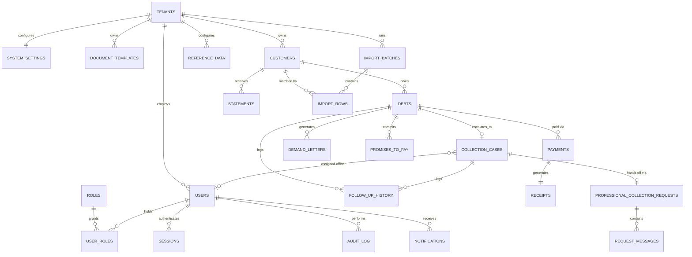

# 06. Database Design

| Field | Value |
|---|---|
| **Document ID** | SRS-DEENDOON-06 |
| **Document Title** | Database Design |
| **Version** | 1.3 |
| **Status** | Approved |
| **State** | Frozen |
| **Author** | Business Analyst / Solution Architect (Claude) |
| **Approved By** | Product Owner |
| **Last Updated** | 2026-07-24 |
| **Scope Baseline** | `01_Project_Overview.md` (Reopened v1.3) · `02_Business_Requirements.md` (Reopened v1.3) · `03_Functional_Requirements.md` (v1.7 — **Module 12 still awaiting its original approval**, see 03's Revision History 1.5) · `04_Business_Rules.md` (Reopened v1.3) · `05_UI_UX_Specification.md` (Approved & Frozen, v1.1) |

---

## Revision History

| Version | Date | Description | Author |
|---|---|---|---|
| 1.0 | 2026-07-24 | Initial draft: full schema derived from Documents 01–05 — 22 tables across Platform/Identity, Customer Management, Debt Register, Payments, Collection & Professional Collection Requests, Documents, Recovery Support, Administration, and Audit. | Claude |
| 1.1 | 2026-07-24 | Architecture review follow-up (four approved changes only): (1) Primary keys changed from UUID to ULID (`CHAR(26)`) throughout, with rationale updated to explain the InnoDB clustered-index write-performance benefit on high-insert tables; (2) `risk_level`, `payment_method`, and `closure_outcome` documentation tightened to state explicitly that they are application-validated against `reference_data`, not foreign-key enforced, so the schema doesn't imply a constraint that isn't actually built; (3) Audit Log design left unchanged — confirmed as an intentional event log, not change-data-capture, matching BR-030/FR-071 verbatim; (4) `archived_at` confirmed as the soft-delete column (not Laravel's default `deleted_at`), with an implementation note added showing `const DELETED_AT = 'archived_at'` preserves full `SoftDeletes` trait support. No other content changed. | Claude |
| 1.2 | 2026-07-24 | **Reopened — database engine change.** The project's database engine is now officially PostgreSQL, replacing the MySQL assumption throughout v1.0/v1.1. Every MySQL/InnoDB-specific type, rationale, and enforcement note has been replaced with a PostgreSQL equivalent: `ENUM(...)` → `VARCHAR` + `CHECK` constraint; `TIMESTAMP` → `TIMESTAMPTZ`; `JSON` → `JSONB`; `TINYINT UNSIGNED`/`SMALLINT UNSIGNED` → `SMALLINT` + `CHECK` (PostgreSQL has no unsigned integer types). The ULID primary-key rationale (Section 3) is re-justified against PostgreSQL's heap-storage/B-tree architecture rather than InnoDB's clustered index. The Foreign-Key indexing note (Section 10) is corrected — PostgreSQL, unlike MySQL/InnoDB, does **not** auto-index foreign keys, which changes the prior guidance from "no action needed" to "must be created explicitly," and every FK-backed index already listed in Section 6 is retained/confirmed for exactly this reason. PostgreSQL Row-Level Security is evaluated and **adopted** as a defense-in-depth layer alongside (not replacing) the already-approved application-layer tenant filtering (Section 2). No table, column, relationship, cardinality, or business rule was added, removed, or renamed — every change is a physical-type or enforcement-mechanism substitution required for PostgreSQL compatibility. | Claude |
| 1.3 | 2026-07-24 | **Architecture review refinement to v1.2's RLS design.** Two changes, both to how RLS is described, not to any table/column/entity: (1) RLS is now presented as the **recommended** PostgreSQL implementation for tenant isolation, with final adoption stated explicitly as an architecture decision belonging to the Product Owner — not asserted as an already-settled fact, throughout Section 2 and every per-table "RLS" annotation in Section 6; (2) the platform-admin bypass on `collection_cases`, `debts`, `tenants`, and `audit_log` is replaced with a **relationship-scoped** policy — visibility requires an `EXISTS` check tracing back through an actual `professional_collection_requests` row, not a flag-only bypass — so the Deendoon Super Admin's access is bounded to exactly what BR-042 approves (data reachable through a submitted Request) rather than a blanket cross-tenant grant. `professional_collection_requests` and `request_messages` keep a flag-based condition, with the reasoning made explicit: for those two tables, "any submitted Request is reviewable" *is* the approved business relationship (BR-042 draws no narrower boundary), so a further `EXISTS` clause there would be circular, not more precise. No business rule, workflow, or entity was changed. **Approved and frozen at this version.** | Claude |

---

## Document Purpose

This document defines the physical data model that implements the approved Version 1 SRS. Every table, column, and constraint below traces to a Functional Requirement (`03_Functional_Requirements.md`), a Business Rule (`04_Business_Rules.md`), or a displayed field (`05_UI_UX_Specification.md`). It does not define API contracts (`07_API_Design.md`) or security implementation detail (`08_Security_and_RBAC.md` — not yet written; see Section 11).

**Guardian note on Deferred Decisions:** `04_Business_Rules.md` carries 46 Deferred Decisions (DD-001–DD-046) — genuine open business questions the approved documents don't yet answer (e.g., the Risk Level value set, the Collection Case closure-outcome set, overpayment handling). Consistent with how `05_UI_UX_Specification.md` treated the same gaps ("specified to accommodate either resolution without redesign"), this document does the same at the schema level: fields whose *value set* is still a Deferred Decision are modeled as tenant-configurable reference data (Section 6.8) or nullable/flexible columns, never as a hardcoded constraint that would silently pre-decide the outcome. Fields whose *mechanics* are still a Deferred Decision (e.g., whether a Payment can be edited, DD-013) simply have no write path defined here beyond what an approved FR specifies. Where a genuinely new architecture decision was required that no prior document implies, it is called out explicitly in **Section 13 — Decisions Required** rather than assumed.

**Scope note:** `08_Security_and_RBAC.md` does not exist yet. Wherever this document would depend on its content (password hashing algorithm, session token format, exact permission-to-role matrix), it says so explicitly rather than inventing detail that document should own.

---

## 1. Database Design Principles

1. **Trace everything.** Every table exists because an approved document requires it. No table is included speculatively.
2. **Configuration over hardcoding, at the schema level too.** Where `04_Business_Rules.md` marks a value set as a Deferred Decision, the schema stores the field as a plain `VARCHAR`, application-validated against tenant-configurable reference data (`reference_data`, Section 6.8) once that category is configured — never a fixed constraint, and never a foreign key, since either would silently impose a rule the business hasn't actually decided on yet — consistent with BC-003 and Product Principle 5.
3. **Never hard-delete.** Per BC-002 / BRL-004, every tenant-owned table that can be archived carries an `archived_at` timestamp; no `DELETE` statement is part of any approved workflow.
4. **The Audit Trail is append-only.** Per BR-030 / BRL-076, `audit_log` accepts `INSERT` only — no application code path, and no database grant, permits `UPDATE` or `DELETE` against it.
5. **Business-facing identifiers are not primary keys.** Auto Numbering values (`DBT-000001`, `RCT-000001`, etc., per BR-036) are a separate, unique, indexed display column — never the table's primary key — so internal keys can remain opaque and tenant-agnostic in format.
6. **Tenant isolation is structural, not incidental.** Every tenant-owned table carries a `tenant_id` foreign key (Section 3); the one approved exception (Professional Collection Requests, reviewed by the Deendoon Super Admin) is called out explicitly, not silently allowed to leak. Application-layer filtering is the approved, load-bearing isolation mechanism; PostgreSQL Row-Level Security (Section 2) is **recommended** as a second, independent layer, pending a Product Owner decision on final adoption.
7. **Money is exact.** All currency columns use fixed-point `NUMERIC(12,2)` (PostgreSQL's canonical name; `DECIMAL` is a supported synonym), matching the 2-decimal, round-half-up convention already established in `04_Business_Rules.md`'s Calculation Rules. Floating-point types are never used for money.
8. **Timestamps are UTC.** All `TIMESTAMPTZ` columns store UTC; timezone presentation is a UI concern (`05_UI_UX_Specification.md`), not a storage concern — consistent with `04_Business_Rules.md` DD-034 leaving timezone *policy* open while this document doesn't presuppose an answer. `TIMESTAMPTZ` (not the bare `TIMESTAMP` type) is used throughout specifically because PostgreSQL always normalizes it to UTC internally regardless of session timezone, closing off the classic ambiguous-local-time bug a bare `TIMESTAMP` invites.
9. **Fixed, approved value sets use `VARCHAR` + `CHECK`, not native `ENUM` types.** PostgreSQL supports a native `CREATE TYPE ... AS ENUM`, but altering it later (adding/removing/reordering values) is materially more ceremony than altering a `CHECK` constraint, which is a plain `DROP CONSTRAINT` / `ADD CONSTRAINT` — fully transactional, no schema-wide type dependency to manage. Every value set below that's fixed and approved (e.g., `customer_status`'s 7 values) is therefore `VARCHAR(50) CHECK (column IN (...))`, not a Postgres `ENUM` type.

---

## 2. Multi-Tenant Strategy

**Pattern: shared database, shared schema, discriminator column.** A single **PostgreSQL** database holds all tenants' data; every tenant-owned table carries a `tenant_id CHAR(26)` foreign key to `tenants`, and every query performed on behalf of a tenant-scoped role is filtered by it. This is a technology/architecture choice within this document's remit — no approved document mandates a specific multi-tenancy pattern, and this one is the standard, cost-appropriate choice for a SaaS product at Version 1 scale (per Product Principle 8, "Enable a scalable commercial SaaS product").

**The one approved exception:** Professional Collection Requests (`professional_collection_requests`, Section 6.5) are created by a tenant (`tenant_id` set, identifying the submitting business) but are reviewed and actioned by the **Deendoon Super Admin** — the one platform-level actor confirmed in `01_Project_Overview.md` (BA-008) who is explicitly *not* tenant-scoped. The Super Admin's queries against this table are the one approved case where the `tenant_id` filter is intentionally *not* applied — they see requests across all tenants by design (BR-042). Every other role, on every other table, is always tenant-filtered.

**Users are the other structural exception:** `users.tenant_id` is **nullable** — required for the six tenant RBAC roles, `NULL` for the Deendoon Platform Administrator (Super Admin), who is a platform-level account per the correction in `01_Project_Overview.md` §1.5. This is not a new actor — it is the schema representation of the actor already approved there.

### Row-Level Security: recommended architecture, pending Product Owner approval

**This document recommends PostgreSQL Row-Level Security (RLS) on every tenant-owned table, as a second layer in addition to — never instead of — the application-layer `tenant_id` filtering already described above. RLS is not presented as an adopted architectural fact: it is a recommendation, and final adoption is an architecture decision for the Product Owner, not something this document settles unilaterally.**

**Justification for the recommendation:**
- This platform holds financial records and PII across many tenants sharing one schema. The single most damaging class of multi-tenant SaaS bug is an application-layer query missing its `WHERE tenant_id = ?` clause — every real-world multi-tenant data leak in this pattern traces back to exactly that. RLS is PostgreSQL's native mechanism for making that bug class structurally impossible rather than merely unlikely: a policy attached to the table is evaluated by the database itself on every query, regardless of whether the application remembered to filter.
- The cost is low. Every tenant-owned table already carries `tenant_id` as the leading column of an index (Section 10) — the exact column an RLS policy needs to evaluate efficiently, so RLS adds negligible query overhead on top of indexing this schema already requires for its own performance reasons.
- RLS does **not** replace the API-layer tenant resolution already specified in `07_API_Design.md` §2 — that document's rule that `tenant_id` is always derived server-side from the session, never trusted from client input, is unchanged and is what sets the PostgreSQL session variable (`app.current_tenant_id`) an RLS policy would read. If adopted, RLS is the database's own backstop for when that application logic is ever wrong, not a replacement for it.

**If adopted, the approved cross-tenant exception must be relationship-scoped, not a flag-only bypass.** A policy of the form "`tenant_id` matches **or** `is_platform_admin = true`" is only correct on the two tables where "any submitted Request is reviewable by the Deendoon Super Admin" *is itself* the entire approved business relationship, per BR-042 — the table's row existing at all is the relationship. Everywhere else, a flag-only bypass would grant the Super Admin more than BR-042 approves (blanket visibility into a tenant's business, rather than only what's reachable through a Request they're actually reviewing), so the bypass condition must instead be an `EXISTS` check tracing back through an actual `professional_collection_requests` row:

| Table | Recommended policy, if RLS is adopted | Basis for the bypass condition |
|---|---|---|
| `professional_collection_requests` | Visible if `tenant_id` matches the session, **or** `is_platform_admin = true`. | Flag alone is correct here — BR-042 approves reviewing *any* submitted Request, unqualified; there is no narrower relationship to check, since this table *is* the relationship. |
| `request_messages` | Visible if its parent `professional_collection_request_id` row is visible under the policy above. | A message is only ever reachable through a Request the reader can already see — not an independent flag check. |
| `collection_cases` | Visible if `tenant_id` matches the session, **or** `EXISTS (SELECT 1 FROM professional_collection_requests pcr WHERE pcr.collection_case_id = collection_cases.id) AND is_platform_admin = true`. | The Super Admin sees a Case only if it was actually submitted to Deendoon — not every Case the tenant has ever opened. |
| `debts` | Visible if `tenant_id` matches the session, **or** `EXISTS (SELECT 1 FROM collection_cases cc JOIN professional_collection_requests pcr ON pcr.collection_case_id = cc.id WHERE cc.debt_id = debts.id) AND is_platform_admin = true`. | The Super Admin sees only the specific Debt linked to a submitted Request (what SCR-049's review Drawer displays) — never a tenant's full Debt book. |
| `tenants` | Visible if `id` matches the session's own tenant, **or** `EXISTS (SELECT 1 FROM professional_collection_requests pcr WHERE pcr.tenant_id = tenants.id) AND is_platform_admin = true`. | The Super Admin sees a tenant's identity (e.g., business name, shown on SCR-049) only if that tenant has submitted at least one Request — not a directory of every tenant on the platform. |
| `audit_log` | Visible if `tenant_id` matches the session, **or** (`entity_type = 'professional_collection_request'` **and** `EXISTS (SELECT 1 FROM professional_collection_requests pcr WHERE pcr.id = audit_log.entity_id AND pcr.tenant_id = <session tenant, if tenant session, else matches an admin-visible Request>)`). | Both sides need the *other* side's entries for one Request's full history: a tenant needs to see the platform-level ("Assigned"/"Status Changed") entries the admin logged under `tenant_id IS NULL`, and the admin needs to see the tenant-logged "Submitted" entry — neither is covered by a simple "own `tenant_id`" match alone, and neither should extend to any *other* audit entry belonging to that tenant/admin. |

This table is the direct output of the architecture review already conducted with you — it does not change any business rule, workflow, or entity; it only makes precise how a *recommended* database mechanism would express BR-042's already-approved, narrow exception, in place of a broader flag check that would have exceeded it.

**Implementation note, not asserted as a decision here:** connection pooling mode affects how the `app.current_tenant_id` session variable is set (`SET LOCAL` within each transaction is required under transaction-mode pooling, e.g., PgBouncer in `transaction` mode; session-mode pooling has more latitude). This is a deployment/operations concern for `09_Non_Functional_Requirements.md`, not a schema decision — noted here only so it isn't lost before that document exists.

**What this recommendation does *not* change:** no table, column, or relationship in Section 6 is different because of it. RLS policies, if adopted, are additional database objects layered on top of the already-approved schema, not a schema redesign — and if the Product Owner ultimately declines RLS, nothing else in this document depends on that decision going either way.

---

## 3. Naming Conventions

| Element | Convention | Example |
|---|---|---|
| Table names | `snake_case`, plural | `customers`, `collection_cases` |
| Column names | `snake_case` | `credit_limit`, `created_at` |
| Primary key | `id`, `CHAR(26)` ULID (see rationale below) | `id` |
| Foreign key | `<singular_referenced_table>_id` | `customer_id`, `debt_id` |
| Boolean columns | `is_` / `has_` prefix | `is_active` |
| Timestamps | `_at` suffix, UTC, always `TIMESTAMPTZ` | `created_at`, `archived_at`, `occurred_at` |
| Soft delete | `archived_at`, **not** Laravel's default `deleted_at` (see implementation note below) | `users.archived_at`, `customers.archived_at`, `debts.archived_at` |
| Business-facing identifiers | `reference_number`, separate from `id` | `DBT-000001` |
| Fixed, approved value sets | `VARCHAR(50)` + `CHECK (column IN (...))`, never a native Postgres `ENUM` type (Principle 9) | `customer_status` |
| Value sets still pending a Deferred Decision | plain `VARCHAR`, **application-validated** against `reference_data` once a tenant configures that category — never a foreign key, and never a `CHECK`-constrained value set (a hard constraint would itself pre-decide the open question) | `risk_level` (`VARCHAR(50)`, DD-010) |

**Primary key rationale:** ULID rather than an auto-incrementing integer or a random UUIDv4, for every table. Sequential integer IDs on a multi-tenant SaaS system leak record counts and invite enumeration (e.g., guessing another tenant's Customer or Debt ID); ULID's 80 bits of randomness close that off just as effectively as a UUIDv4 would.

The performance reasoning is specific to PostgreSQL's actual storage architecture, not carried over from another engine: PostgreSQL stores rows in **unordered heap files** — unlike a clustered-index engine, it does not physically order table rows by primary key, so there is no "table clustering" benefit to gain from an ordered key. The benefit that *does* apply is at the **B-tree index level**: the primary key still lives in a B-tree index (as does every other index on the table), and a fully random UUIDv4 causes new entries to land at random points throughout that B-tree, leading to more page splits, more index bloat, and worse buffer-cache locality as high-insert tables grow — this is a well-documented PostgreSQL characteristic, independent of heap clustering. ULID's leading 48-bit timestamp means new entries append near the right edge of the index instead, keeping the working set of "hot" index pages small and reducing bloat on this schema's append-heavy tables (`audit_log`, `notifications`, `follow_up_history`, `request_messages`). Laravel supports both natively (`HasUuids` / `HasUlids`), so this carries no framework cost. Business-facing Auto Numbering (`DBT-000001`) remains the human-readable identifier per BR-036 — the ULID is purely internal, and its embedded timestamp is not treated as a business-meaningful or hidden value (`created_at` already exposes creation time).

**Soft-delete column rationale and Laravel implementation note:** `archived_at` is used instead of Laravel's conventional `deleted_at` because "Archive," never "Delete," is domain language established throughout this SRS (BC-002, Product Principle 4, and `05_UI_UX_Specification.md`'s explicit rule that the word "Delete" never appears where "Archive" is meant) — the schema should say what the system actually does, not default to a framework convention that implies removal. This costs nothing functionally: Eloquent's `SoftDeletes` trait reads the column name from `static::DELETED_AT` if defined, so every archivable model declares:

```php
const DELETED_AT = 'archived_at';
```

...and gets the full `SoftDeletes` trait — automatic exclusion from default queries, `withTrashed()`, `onlyTrashed()`, `restore()` — with a column name matching the domain vocabulary instead of the framework default. This is unaffected by the PostgreSQL migration — it is a Laravel/Eloquent-layer concern, not a database-engine concern.

---

## 4. Entity Relationship Overview (ERD)



This diagram shows cardinality only; every column, constraint, and index is defined in Section 6.

---

## 5. Entity Relationship Overview — Grouping

Tables are grouped below to mirror the twelve approved Functional Requirements modules, for navigability:

| Group | Tables | Modules |
|---|---|---|
| Platform & Identity | `tenants`, `users`, `roles`, `user_roles`, `sessions` | 1, 12 |
| Customer Management | `customers`, `import_batches`, `import_rows` | 2 |
| Debt Register & Recovery Support | `debts`, `follow_up_history`, `promises_to_pay` | 3, 5 |
| Payments | `payments` | 6 |
| Collection & Professional Collection Requests | `collection_cases`, `professional_collection_requests`, `request_messages` | 7 |
| Documents | `receipts`, `demand_letters`, `statements`, `document_events` | 8 |
| Notifications | `notifications` | 10 |
| Administration | `system_settings`, `document_templates`, `reference_data` | 12 |
| Audit | `audit_log` | Cross-cutting (BR-030) |

Reporting (Module 9) and Search (Module 11) introduce **no new tables** — per their own Scope Boundaries in `03_Functional_Requirements.md`, both are strictly read-only consumers of the tables above.

---

## 6. Table Definitions

### 6.1 Platform & Identity

#### `tenants`
**Purpose:** One row per business using Deendoon. Also holds Company Profile identity fields (FR-068) — folded in rather than a separate 1:1 table, since a tenant's name/branding *is* its identity, not a distinct configurable behavior.

| Column | Type | Constraints | Default | Notes |
|---|---|---|---|---|
| `id` | `CHAR(26)` | PK | — | |
| `business_name` | `VARCHAR(255)` | NOT NULL | — | BRL-073 |
| `logo_path` | `VARCHAR(500)` | NULL | NULL | Format/size constraints: UI/NFR concern, not this document (BRL-073 Notes) |
| `address` | `VARCHAR(500)` | NULL | NULL | |
| `contact_email` | `VARCHAR(255)` | NULL | NULL | |
| `contact_phone` | `VARCHAR(30)` | NULL | NULL | |
| `created_at` | `TIMESTAMPTZ` | NOT NULL | `now()` | |
| `updated_at` | `TIMESTAMPTZ` | NOT NULL | `now()` | |

**Foreign Keys:** none. **Indexes:** none beyond PK (single-row lookups by `id` only). **RLS (recommended, pending Product Owner approval):** `tenants` is the tenancy boundary itself, so its policy is a variant of the pattern used elsewhere — if adopted, a session sees its own row (`id = current_setting('app.current_tenant_id', true)::char(26)`), **or** — relationship-scoped, not a directory-wide bypass — the Deendoon Super Admin sees a tenant's identity (e.g., `business_name`, shown on SCR-049) only where `EXISTS (SELECT 1 FROM professional_collection_requests pcr WHERE pcr.tenant_id = tenants.id)`, i.e., only tenants that have actually submitted a Request, never a full list of every business on the platform (see Section 2's policy table).

#### `users`
**Purpose:** All authenticated accounts — the six tenant RBAC roles and the one platform-level Deendoon Super Admin (Module 1, Module 12).

| Column | Type | Constraints | Default | Notes |
|---|---|---|---|---|
| `id` | `CHAR(26)` | PK | — | |
| `tenant_id` | `CHAR(26)` | FK → `tenants.id`, **NULLABLE** | NULL | NULL only for the Deendoon Super Admin (Section 2) |
| `name` | `VARCHAR(255)` | NOT NULL | — | |
| `identifier` | `VARCHAR(255)` | NOT NULL, UNIQUE per `tenant_id` (or globally unique where `tenant_id IS NULL`) | — | Email or username, per configurable identifier type, FR-001 |
| `credential_hash` | `VARCHAR(255)` | NOT NULL | — | Hashing algorithm: `08_Security_and_RBAC.md` (not yet written) |
| `status` | `VARCHAR(20)` | NOT NULL, `CHECK (status IN ('active','archived'))` | `'active'` | BC-002 — deactivation is Archive, never delete (FR-066) |
| `created_at` / `updated_at` / `archived_at` | `TIMESTAMPTZ` | `archived_at` NULLABLE | — | |

**Foreign Keys:** `tenant_id` → `tenants.id`. **Indexes:** `(tenant_id, identifier)` unique; `(identifier)` for the NULL-tenant case; `(status)`. **RLS (recommended, pending Product Owner approval):** if adopted, a row would be visible where `tenant_id = current_setting('app.current_tenant_id', true)::char(26)` or `tenant_id IS NULL AND current_setting('app.is_platform_admin', true) = 'true'`. This is not a cross-tenant bypass — the `tenant_id IS NULL` branch only ever matches the Deendoon Super Admin's own account row(s), never another tenant's staff.

#### `roles`
**Purpose:** Fixed lookup of the seven approved roles — six tenant-scoped, one platform-level. Not user-editable (no FR permits creating new roles — RBAC role *names* are fixed by BR-029; only role *assignment* is a user action).

| Column | Type | Constraints | Default | Notes |
|---|---|---|---|---|
| `id` | `CHAR(26)` | PK | — | |
| `name` | `VARCHAR(50)` | NOT NULL, UNIQUE, `CHECK (name IN ('super_admin','operations_manager','collection_officer','finance','support','viewer','deendoon_platform_administrator'))` | — | BR-029; last value is BA-008 |
| `is_tenant_scoped` | `BOOLEAN` | NOT NULL | `TRUE` | `FALSE` only for `deendoon_platform_administrator` |

Seeded with exactly seven rows at deployment; no FR provides a create/edit/delete path for this table. **RLS:** not applicable — a fixed, platform-wide lookup table with no tenant ownership.

#### `user_roles`
**Purpose:** Join table between `users` and `roles`.

| Column | Type | Constraints | Default | Notes |
|---|---|---|---|---|
| `id` | `CHAR(26)` | PK | — | |
| `user_id` | `CHAR(26)` | FK → `users.id`, NOT NULL | — | |
| `role_id` | `CHAR(26)` | FK → `roles.id`, NOT NULL | — | |
| `assigned_at` | `TIMESTAMPTZ` | NOT NULL | `now()` | |

**Modeled as many-to-many deliberately:** whether a user may hold more than one Role is DD-039 (unresolved). A join table supports either outcome — single-role is simply "the application enforces at most one row per `user_id`" — without a future schema migration. Do not read the many-to-many *shape* as confirmation that multi-role is approved; it is not (see Section 13).

**Foreign Keys:** `user_id` → `users.id`; `role_id` → `roles.id`. **Indexes:** unique `(user_id, role_id)`; `(user_id)` and `(role_id)` explicitly created (PostgreSQL does not auto-index FK columns — Section 10). **RLS (recommended, pending Product Owner approval):** if adopted, via a join back to `users.tenant_id` in the policy predicate (or accessed only through the `users`/`admin` API surface, which is itself tenant-filtered — either approach is an implementation detail, not asserted here).

#### `sessions`
**Purpose:** Authenticated session tracking (FR-001, FR-002, FR-003).

| Column | Type | Constraints | Default | Notes |
|---|---|---|---|---|
| `id` | `CHAR(26)` | PK | — | Session token format: `08_Security_and_RBAC.md` |
| `user_id` | `CHAR(26)` | FK → `users.id`, NOT NULL | — | |
| `created_at` | `TIMESTAMPTZ` | NOT NULL | `now()` | |
| `last_active_at` | `TIMESTAMPTZ` | NOT NULL | `now()` | Drives sliding-window expiry, FR-003 A1 |
| `expires_at` | `TIMESTAMPTZ` | NOT NULL | — | |
| `invalidated_at` | `TIMESTAMPTZ` | NULLABLE | NULL | Set on logout, password change (FR-005), or role change (FR-067) |

**Foreign Keys:** `user_id` → `users.id`. **Indexes:** `(user_id)`; `(expires_at)` for expiry sweeps. **RLS:** not applicable at the table-policy level — a session row is only ever addressed by its own token holder, enforced at the application/API layer (`07_API_Design.md` §2), not by a tenant-comparison policy. The mapping between this table and the Laravel Sanctum implementation referenced in `07` remains an implementation-time concern, not restated here.

---

### 6.2 Customer Management

#### `customers`
**Purpose:** The business's own debtors (Module 2, Module 4).

| Column | Type | Constraints | Default | Notes |
|---|---|---|---|---|
| `id` | `CHAR(26)` | PK | — | |
| `tenant_id` | `CHAR(26)` | FK → `tenants.id`, NOT NULL | — | |
| `name` | `VARCHAR(255)` | NOT NULL | — | FR-007 |
| `phone` | `VARCHAR(30)` | NOT NULL | — | FR-007; matching sensitivity for duplicate detection is DD-003 |
| `customer_status` | `VARCHAR(20)` | NOT NULL, `CHECK (customer_status IN ('active','good_standing','late_payer','high_risk','in_collection','recovered','blocked'))` | `'active'` | BRL-014, 7 approved values — fixed, approved set (unlike Risk Level) |
| `credit_limit` | `NUMERIC(12,2)` | NOT NULL | tenant's `system_settings.default_credit_limit` at creation | BRL-012 |
| `outstanding_balance` | `NUMERIC(12,2)` | NOT NULL | `0.00` | Derived: Σ `debts.remaining_balance` for this customer's open debts (BRL-017); maintained by application logic on Debt/Payment write, not user-editable |
| `risk_level` | `VARCHAR(50)` | NULLABLE | NULL | Value set pending DD-010. Application-validated against `reference_data` (category `risk_level`) once configured — **not** a foreign key; see Section 6.8. |
| `credit_score` | `SMALLINT` | NULLABLE, `CHECK (credit_score BETWEEN 0 AND 100)` | NULL | Baseline pending DD-008. PostgreSQL has no unsigned integer type; the `CHECK` bound is the sole non-negativity guarantee, which is sufficient here. |
| `credit_score_band` | `VARCHAR(20)` | NULLABLE, `CHECK (credit_score_band IN ('excellent','good','fair','poor'))` | NULL | Labels approved; numeric thresholds pending DD-009 |
| `created_at` / `updated_at` / `archived_at` | `TIMESTAMPTZ` | `archived_at` NULLABLE | — | BC-002 |

**Foreign Keys:** `tenant_id` → `tenants.id`. **Indexes:** `(tenant_id, phone)`; `(tenant_id, name)`; `(tenant_id, customer_status)`; `(tenant_id, archived_at)`. **RLS (recommended, pending Product Owner approval):** if adopted, `tenant_id = current_setting('app.current_tenant_id', true)::char(26)`, with **no** platform-level bypass on this table — the Deendoon Super Admin does not have general Customer visibility; only what BR-042 approves via Professional Collection Requests, and `customers` isn't even reachable through that chain (only `debts` and `tenants` are — see Section 2).

#### `import_batches` / `import_rows`
**Purpose:** Customer Import staging (FR-016).

`import_batches`: `id`, `tenant_id` FK, `uploaded_by_user_id` FK → `users.id`, `file_name VARCHAR(255)`, `status VARCHAR(20) CHECK (status IN ('preview','validated','committed','cancelled'))`, `created_at TIMESTAMPTZ`.

`import_rows`: `id`, `batch_id` FK → `import_batches.id`, `row_number SMALLINT`, `row_data JSONB` (parsed source fields), `validation_status VARCHAR(20) CHECK (validation_status IN ('valid','invalid'))`, `validation_errors JSONB NULLABLE`, `duplicate_match_customer_id CHAR(26) NULLABLE` FK → `customers.id`, `resolution VARCHAR(20) NULLABLE CHECK (resolution IN ('skip','update','new'))`, `resulting_customer_id CHAR(26) NULLABLE` FK → `customers.id`.

**Indexes:** `import_rows(batch_id)`; `import_rows(duplicate_match_customer_id)`; `import_batches(tenant_id)`. **RLS (recommended, pending Product Owner approval):** if adopted, on both, `tenant_id`-scoped (`import_rows` via its parent `batch_id` join or a denormalized `tenant_id` column — implementation detail).

---

### 6.3 Debt Register & Recovery Support

#### `debts`
**Purpose:** Individual receivables (Module 3).

| Column | Type | Constraints | Default | Notes |
|---|---|---|---|---|
| `id` | `CHAR(26)` | PK | — | |
| `tenant_id` | `CHAR(26)` | FK → `tenants.id`, NOT NULL | — | |
| `customer_id` | `CHAR(26)` | FK → `customers.id`, NOT NULL | — | FR-017 |
| `reference_number` | `VARCHAR(20)` | NOT NULL, UNIQUE per tenant | — | `DBT-000001`, BR-036, BRL-053 |
| `amount` | `NUMERIC(12,2)` | NOT NULL, `CHECK (amount > 0)` | — | |
| `due_date` | `DATE` | NOT NULL | — | |
| `debt_status` | `VARCHAR(20)` | NOT NULL, `CHECK (debt_status IN ('draft','pending','overdue','partial_paid','paid','cancelled','written_off'))` | pending DD-006 (Draft vs. Pending) | BRL-020, BRL-021 transition matrix |
| `remaining_balance` | `NUMERIC(12,2)` | NOT NULL | = `amount` at creation | Maintained by application logic on Payment (BRL-022); never directly user-editable |
| `recovery_stage` | `SMALLINT` | NOT NULL, `CHECK (recovery_stage BETWEEN 1 AND 6)` | `1` (pending confirmation of Module 5's initial-stage rule) | BRL-031. PostgreSQL has no `TINYINT`; `SMALLINT` (2 bytes) is the smallest applicable integer type. |
| `notes` | `TEXT` | NULLABLE | NULL | |
| `created_at` / `updated_at` / `archived_at` | `TIMESTAMPTZ` | `archived_at` NULLABLE | — | BC-002 |

**Foreign Keys:** `tenant_id` → `tenants.id`; `customer_id` → `customers.id`. **Indexes:** `(tenant_id, reference_number)` unique; `(tenant_id, customer_id)`; `(tenant_id, debt_status)`; `(tenant_id, due_date)` (Aging Analysis, FR-054); `(tenant_id, recovery_stage)`. **RLS (recommended, pending Product Owner approval):** if adopted, `tenant_id` match for the owning tenant, **or** — relationship-scoped, not a flag alone — visible to the Deendoon Super Admin only where `EXISTS (SELECT 1 FROM collection_cases cc JOIN professional_collection_requests pcr ON pcr.collection_case_id = cc.id WHERE cc.debt_id = debts.id)`, matching exactly the single Debt shown in SCR-049's review Drawer, never a tenant's full Debt book (see Section 2's policy table).

#### `follow_up_history`
**Purpose:** Chronological recovery-action log (FR-033).

| Column | Type | Constraints | Default | Notes |
|---|---|---|---|---|
| `id` | `CHAR(26)` | PK | — | |
| `tenant_id` | `CHAR(26)` | FK, NOT NULL | — | |
| `debt_id` | `CHAR(26)` | FK → `debts.id`, NOT NULL | — | |
| `collection_case_id` | `CHAR(26)` | FK → `collection_cases.id`, NULLABLE | NULL | Set when the activity originates from Module 7 (FR-044) |
| `action_type` | `VARCHAR(30)` | NOT NULL, `CHECK (action_type IN ('reminder_sent','manual_whatsapp','manual_sms','call_logged','promise_recorded','promise_fulfilled','promise_broken','payment_recorded','collection_activity','escalated'))` | — | |
| `actor_user_id` | `CHAR(26)` | FK → `users.id`, NULLABLE | NULL | NULL = system-automated |
| `details` | `TEXT` | NULLABLE | NULL | |
| `occurred_at` | `TIMESTAMPTZ` | NOT NULL | `now()` | |

**Foreign Keys:** `tenant_id`, `debt_id`, `collection_case_id`, `actor_user_id` as above, each explicitly indexed (Section 10). **Indexes:** `(tenant_id, debt_id, occurred_at)`. **RLS (recommended, pending Product Owner approval):** if adopted, tenant-scoped.

#### `promises_to_pay`
**Purpose:** Promise to Pay commitments (FR-031).

| Column | Type | Constraints | Default | Notes |
|---|---|---|---|---|
| `id` | `CHAR(26)` | PK | — | |
| `tenant_id` | `CHAR(26)` | FK, NOT NULL | — | |
| `debt_id` | `CHAR(26)` | FK → `debts.id`, NOT NULL | — | |
| `promised_date` | `DATE` | NOT NULL | — | |
| `status` | `VARCHAR(20)` | NOT NULL, `CHECK (status IN ('open','fulfilled','broken'))` | `'open'` | Revision handling (edit vs. break-then-renew) is DD-013 — no revision write path defined here beyond creating a new row |
| `created_by_user_id` | `CHAR(26)` | FK → `users.id`, NOT NULL | — | |
| `created_at` / `resolved_at` | `TIMESTAMPTZ` | `resolved_at` NULLABLE | — | |

**Indexes:** `(tenant_id, debt_id)`; `(tenant_id, promised_date)` (Calendar View, FR-062). **RLS (recommended, pending Product Owner approval):** if adopted, tenant-scoped.

---

### 6.4 Payments

#### `payments`
**Purpose:** Payment Tracking — the sole owner of payment records (Module 6, Scope Boundary).

| Column | Type | Constraints | Default | Notes |
|---|---|---|---|---|
| `id` | `CHAR(26)` | PK | — | |
| `tenant_id` | `CHAR(26)` | FK, NOT NULL | — | |
| `debt_id` | `CHAR(26)` | FK → `debts.id`, NOT NULL | — | FR-034 |
| `amount` | `NUMERIC(12,2)` | NOT NULL, `CHECK (amount > 0)` | — | Overpayment handling (cap/reject/credit) is DD-016 — this CHECK enforces only "positive," not a ceiling, so it doesn't pre-decide DD-016 |
| `payment_date` | `DATE` | NOT NULL | — | |
| `payment_method` | `VARCHAR(50)` | NULLABLE | NULL | Whether this is even a fixed catalog or free text at all is DD-019 — VARCHAR supports either outcome without a schema change. If a catalog is adopted, values would be application-validated against `reference_data` (category `payment_method`) once configured — **not** a foreign key; see Section 6.8. |
| `reference_notes` | `VARCHAR(500)` | NULLABLE | NULL | |
| `recorded_by_user_id` | `CHAR(26)` | FK → `users.id`, NOT NULL | — | |
| `created_at` | `TIMESTAMPTZ` | NOT NULL | `now()` | **No `updated_at`/`deleted_at`.** Editing, archival, and reversal are all DD-018 (unresolved) — this table therefore has no write path beyond `INSERT` until that decision is made (see Section 13). |

**Foreign Keys:** `tenant_id`, `debt_id`, `recorded_by_user_id`, each explicitly indexed. **Indexes:** `(tenant_id, debt_id, payment_date)`. **RLS (recommended, pending Product Owner approval):** if adopted, tenant-scoped. Because this table is insert-only (no `UPDATE` path is approved), it is also naturally immune to PostgreSQL's MVCC dead-tuple bloat from row updates — every row is written once and never revisited, which keeps autovacuum pressure on this table low without any special tuning.

---

### 6.5 Collection & Professional Collection Requests

#### `collection_cases`
**Purpose:** Internal formal escalation (Module 7, FR-040–046).

| Column | Type | Constraints | Default | Notes |
|---|---|---|---|---|
| `id` | `CHAR(26)` | PK | — | |
| `tenant_id` | `CHAR(26)` | FK, NOT NULL | — | |
| `debt_id` | `CHAR(26)` | FK → `debts.id`, NOT NULL | — | Enforces "at most one open Case per Debt," BRL-048, via the partial unique index below |
| `reference_number` | `VARCHAR(20)` | NOT NULL, UNIQUE per tenant | — | `COL-000001` |
| `assigned_officer_user_id` | `CHAR(26)` | FK → `users.id`, NULLABLE | NULL | FR-041 |
| `case_status` | `VARCHAR(20)` | NOT NULL, `CHECK (case_status IN ('open','closed'))` | pending DD-020 (initial value) | BRL-050 |
| `closure_outcome` | `VARCHAR(50)` | NULLABLE | NULL | Value set pending DD-024. Application-validated against `reference_data` (category `collection_outcome`) once configured — **not** a foreign key; see Section 6.8. |
| `created_at` / `updated_at` / `closed_at` | `TIMESTAMPTZ` | `closed_at` NULLABLE | — | |

**Foreign Keys:** `tenant_id`, `debt_id`, `assigned_officer_user_id`, each explicitly indexed. **Indexes:** `CREATE UNIQUE INDEX ON collection_cases (debt_id) WHERE case_status = 'open'` — a native PostgreSQL **partial unique index**, enforcing BRL-048 directly at the database level; `(tenant_id, case_status)`; `(tenant_id, assigned_officer_user_id)`. **PostgreSQL note:** partial indexes are a first-class, well-supported PostgreSQL feature — this constraint is expressed more directly here than it could have been under the originally-assumed engine, which has no equivalent. **RLS (recommended, pending Product Owner approval):** if adopted, `tenant_id` match for the owning tenant, **or** — relationship-scoped, not a flag alone — visible to the Deendoon Super Admin only where `EXISTS (SELECT 1 FROM professional_collection_requests pcr WHERE pcr.collection_case_id = collection_cases.id)`, i.e., only Cases that were actually submitted to Deendoon, never every Case a tenant has opened (see Section 2's policy table).

#### `professional_collection_requests`
**Purpose:** Tenant hand-off of a Collection Case to the Deendoon Super Admin (FR-072–076, the reopened scope).

| Column | Type | Constraints | Default | Notes |
|---|---|---|---|---|
| `id` | `CHAR(26)` | PK | — | |
| `tenant_id` | `CHAR(26)` | FK → `tenants.id`, NOT NULL | — | Identifies the *submitting* business; **the Deendoon Super Admin's queries against this table are the one approved exception to tenant filtering** (Section 2), expressed, if RLS is adopted, as a policy branch — not a bypass of the model itself |
| `collection_case_id` | `CHAR(26)` | FK → `collection_cases.id`, NOT NULL | — | Enforces "at most one active Request per Case," BRL-078, via the partial unique index below; exact reject-vs-surface behavior on a duplicate attempt is DD-042 |
| `reference_number` | `VARCHAR(20)` | NULLABLE, UNIQUE per tenant | NULL | `PCR-000001` proposed, not yet formally confirmed — DD-045 |
| `status` | `VARCHAR(30)` | NOT NULL, `CHECK (status IN ('submitted','under_review','need_more_information','accepted','assigned','in_progress','recovered','closed'))` | `'submitted'` | BRL-079. **"Assigned" means the Deendoon Super Admin has accepted ownership and started handling the Request — not assignment to another system user, role, or team** (BRL-079; no other Deendoon-side actor exists, per `01_Project_Overview.md`) |
| `submitted_by_user_id` | `CHAR(26)` | FK → `users.id`, NOT NULL | — | Tenant user, FR-072 |
| `actioned_by_user_id` | `CHAR(26)` | FK → `users.id`, NULLABLE | NULL | Always the Deendoon Super Admin account when set |
| `created_at` / `updated_at` / `closed_at` | `TIMESTAMPTZ` | `closed_at` NULLABLE | — | |

**Foreign Keys:** `tenant_id`, `collection_case_id`, `submitted_by_user_id`, `actioned_by_user_id`, each explicitly indexed. **Indexes:** `CREATE UNIQUE INDEX ON professional_collection_requests (collection_case_id) WHERE status NOT IN ('recovered','closed')` — partial unique index enforcing BRL-078; `(status)` (Deendoon Super Admin's cross-tenant queue view, SCR-049); `(tenant_id, status)` (tenant's own view, SCR-005/025). **RLS (recommended, pending Product Owner approval):** if adopted, `tenant_id` match for the owning tenant, **or** `is_platform_admin = true`. Unlike `collection_cases`/`debts`/`tenants`/`audit_log` below, this table's bypass is deliberately flag-only, not `EXISTS`-scoped: BR-042 approves the Deendoon Super Admin reviewing *any* submitted Request without qualification, so this table's rows already *are* the full approved relationship — an `EXISTS` clause against itself would be circular, not more precise (see Section 2's policy table for the reasoning applied consistently across all six tables).

**Not modeled:** any assignment-among-Deendoon-staff column. Per the correction in `01_Project_Overview.md`, there is exactly one Deendoon-side actor; this table has no `assigned_specialist_id`-style column, deliberately.

#### `request_messages`
**Purpose:** The shared Conversation Thread (FR-075, BRL-080).

| Column | Type | Constraints | Default | Notes |
|---|---|---|---|---|
| `id` | `CHAR(26)` | PK | — | |
| `professional_collection_request_id` | `CHAR(26)` | FK → `professional_collection_requests.id`, NOT NULL | — | |
| `sender_user_id` | `CHAR(26)` | FK → `users.id`, NOT NULL | — | Either a tenant user or the Deendoon Super Admin |
| `content` | `TEXT` | NOT NULL | — | |
| `created_at` | `TIMESTAMPTZ` | NOT NULL | `now()` | **No `updated_at`/`deleted_at` — messages are immutable** (BRL-080), consistent with Audit Trail immutability |

**Indexes:** `(professional_collection_request_id, created_at)`; `(professional_collection_request_id)` explicitly indexed for the FK itself. **RLS (recommended, pending Product Owner approval):** if adopted, relationship-scoped by construction — a message is visible only if its parent `professional_collection_request_id` row is visible under that table's own policy above. No independent flag check on this table.

---

### 6.6 Documents

#### `receipts`, `demand_letters`, `statements`
Three tables sharing a common shape (Module 8):

| Column | `receipts` | `demand_letters` | `statements` |
|---|---|---|---|
| `id` | CHAR(26) PK | CHAR(26) PK | CHAR(26) PK |
| `tenant_id` | FK, NOT NULL | FK, NOT NULL | FK, NOT NULL |
| `reference_number` | `RCT-000001`, unique/tenant | `DL-000001`, unique/tenant, **shared across all 4 templates including Legal Notice** (BRL-053) | `ST-000001`, unique/tenant |
| Source link | `payment_id` FK → `payments.id`, NOT NULL | `debt_id` FK → `debts.id`, NOT NULL | `customer_id` FK → `customers.id`, NOT NULL; `debt_id` FK NULLABLE (scope when triggered from Debt Details — open item in FR-049) |
| `template_type` | — | `VARCHAR(20) CHECK (template_type IN ('first_reminder','second_reminder','final_demand','legal_notice'))` | — |
| `generated_at` | `TIMESTAMPTZ` NOT NULL | `TIMESTAMPTZ` NOT NULL | `TIMESTAMPTZ` NOT NULL |
| `file_path` | `VARCHAR(500)` NOT NULL | `VARCHAR(500)` NOT NULL | `VARCHAR(500)` NOT NULL |

All three are **immutable after generation** (BRL-057) — no `UPDATE` path; regeneration mechanics (new row vs. reuse of `reference_number`) are DD-029. Immutability is enforced at the application/service layer (Section 8) — PostgreSQL does not have a native "freeze this row after insert" primitive either, so this is unchanged from the original approach in spirit, only the specific unavailable-feature citation changes (Section 8).

**Indexes:** each table: `(tenant_id, reference_number)` unique; `receipts(payment_id)`; `demand_letters(debt_id)`; `statements(customer_id)` — all explicitly created (Section 10). **RLS (recommended, pending Product Owner approval):** if adopted, on all three, tenant-scoped. No Deendoon Super Admin bypass on any of the three — Documents are not part of the approved Professional Collection Request review scope.

#### `document_events`
**Purpose:** Document History across all three document types (FR-052) — one shared log rather than three near-duplicate tables.

| Column | Type | Constraints | Default | Notes |
|---|---|---|---|---|
| `id` | `CHAR(26)` | PK | — | |
| `tenant_id` | `CHAR(26)` | FK, NOT NULL | — | |
| `document_type` | `VARCHAR(20)` | NOT NULL, `CHECK (document_type IN ('receipt','demand_letter','statement'))` | — | |
| `document_id` | `CHAR(26)` | NOT NULL (polymorphic — points into whichever table `document_type` names) | — | |
| `event_type` | `VARCHAR(20)` | NOT NULL, `CHECK (event_type IN ('generated','downloaded','regenerated'))` | — | Exactly the three lifecycle events approved in `03_Functional_Requirements.md` FR-052 — no additional event types |
| `user_id` | `CHAR(26)` | FK → `users.id`, NULLABLE | NULL | NULL for the automatic `generated` event on Receipts |
| `occurred_at` | `TIMESTAMPTZ` | NOT NULL | `now()` | |

**Indexes:** `(tenant_id, document_type, document_id, occurred_at)`. **RLS (recommended, pending Product Owner approval):** if adopted, tenant-scoped.

---

### 6.7 Notifications

#### `notifications`
**Purpose:** In-app, consumption-only Notification Center (Module 10). Never written to directly by any user action — only by the modules that own the underlying events.

| Column | Type | Constraints | Default | Notes |
|---|---|---|---|---|
| `id` | `CHAR(26)` | PK | — | |
| `tenant_id` | `CHAR(26)` | FK, NOT NULL | — | |
| `recipient_user_id` | `CHAR(26)` | FK → `users.id`, NOT NULL | — | |
| `type` | `VARCHAR(50)` | NOT NULL, `CHECK (type IN ('credit_limit_reached','payment_received','document_available','collection_assignment','reminder_sent','promise_to_pay_due','professional_collection_request_update'))` | — | FR-058's enumerated event sources plus the reopened Request-update event |
| `related_entity_type` | `VARCHAR(50)` | NOT NULL | — | e.g., `'debt'`, `'payment'`, `'professional_collection_request'` |
| `related_entity_id` | `CHAR(26)` | NOT NULL | — | |
| `read_at` | `TIMESTAMPTZ` | NULLABLE | NULL | FR-059 |
| `created_at` | `TIMESTAMPTZ` | NOT NULL | `now()` | |

**Indexes:** `(recipient_user_id, read_at)`; `(recipient_user_id, type)`; `(tenant_id, created_at)`. **RLS (recommended, pending Product Owner approval):** if adopted, tenant-scoped; also implicitly recipient-scoped at the application layer (a user only ever requests their own notifications), which RLS would not need to separately enforce since `07_API_Design.md` never exposes another user's `recipient_user_id` as a queryable parameter.

---

### 6.8 Administration

#### `system_settings`
**Purpose:** Tenant-level configurable policy (FR-069) — one row per tenant.

| Column | Type | Constraints | Default | Notes |
|---|---|---|---|---|
| `id` | `CHAR(26)` | PK | — | |
| `tenant_id` | `CHAR(26)` | FK → `tenants.id`, NOT NULL, UNIQUE | — | 1:1 with tenant |
| `default_credit_limit` | `NUMERIC(12,2)` | NOT NULL | value set at tenant onboarding | BRL-012 |
| `credit_limit_reminder_enabled` | `BOOLEAN` | NOT NULL | `TRUE` | |
| `soft_limit_warning_threshold` | `NUMERIC(5,2)` | NULLABLE | NULL | Percentage of limit that triggers the soft warning; exact validation range is DD-040 |
| `whatsapp_reminder_days` | `JSONB` | NULLABLE | NULL | Reminder timing config, BR-011 — structure left flexible since exact schedule shape was never enumerated in approved scope. `JSONB` (not `JSON`) is used throughout this document for every JSON-typed column — PostgreSQL's binary, indexable, pre-parsed representation, with no approved requirement anywhere for preserving exact key ordering or whitespace that would call for plain `JSON` instead. |
| `sms_reminder_days` | `JSONB` | NULLABLE | NULL | |
| `call_reminder_days` | `JSONB` | NULLABLE | NULL | |
| `professional_collection_threshold_days` | `SMALLINT` | NULLABLE, `CHECK (professional_collection_threshold_days >= 0)` | NULL | PostgreSQL has no unsigned integer type; the `CHECK` is the non-negativity guarantee |
| `notification_settings` | `JSONB` | NULLABLE | NULL | |
| `updated_at` | `TIMESTAMPTZ` | NOT NULL | `now()` | |

**Indexes:** `(tenant_id)` unique. **RLS (recommended, pending Product Owner approval):** if adopted, tenant-scoped.

#### `document_templates`
**Purpose:** The four Demand Letter templates, per tenant (FR-069, part of System Preferences).

| Column | Type | Constraints | Default | Notes |
|---|---|---|---|---|
| `id` | `CHAR(26)` | PK | — | |
| `tenant_id` | `CHAR(26)` | FK, NOT NULL | — | |
| `template_type` | `VARCHAR(20)` | NOT NULL, UNIQUE per tenant, `CHECK (template_type IN ('first_reminder','second_reminder','final_demand','legal_notice'))` | — | |
| `content` | `TEXT` | NOT NULL | seeded default wording | Exact customizable-field constraints: DD-031 |
| `updated_at` | `TIMESTAMPTZ` | NOT NULL | `now()` | |

**Indexes:** `(tenant_id, template_type)` unique. **RLS (recommended, pending Product Owner approval):** if adopted, tenant-scoped.

#### `reference_data`
**Purpose:** The single mechanism holding every value set still pending a Deferred Decision (FR-070) — Risk Level, Payment Method, Collection Case closure outcome, and any future confirmed set — so this document never has to hardcode an undecided business answer as a rigid constraint. **Enforcement is application-level, not database-level:** columns like `customers.risk_level`, `payments.payment_method`, and `collection_cases.closure_outcome` are plain `VARCHAR`, validated by application code against the active rows here — none of them carry a foreign key to this table. This is deliberate: a hard FK would force every such field to be non-empty-or-valid-per-catalog from day one, which would itself resolve the underlying Deferred Decision (e.g., DD-019's "catalog vs. free text" question) as a side effect of a schema constraint, rather than as an explicit business decision.

| Column | Type | Constraints | Default | Notes |
|---|---|---|---|---|
| `id` | `CHAR(26)` | PK | — | |
| `tenant_id` | `CHAR(26)` | FK, NOT NULL | — | |
| `category` | `VARCHAR(30)` | NOT NULL, `CHECK (category IN ('risk_level','payment_method','collection_outcome'))` | — | Extend this constraint only when a new Deferred Decision is resolved in favor of a configurable set — not speculatively |
| `value_label` | `VARCHAR(100)` | NOT NULL | — | |
| `sort_order` | `SMALLINT` | NOT NULL | `0` | |
| `is_active` | `BOOLEAN` | NOT NULL | `TRUE` | Removing an in-use value (DD-041/DD-047-equivalent) sets this rather than deleting the row |
| `created_at` | `TIMESTAMPTZ` | NOT NULL | `now()` | |

**Indexes:** `(tenant_id, category, is_active)`. **RLS (recommended, pending Product Owner approval):** if adopted, tenant-scoped — each tenant configures its own reference values independently.

---

### 6.9 Audit

#### `audit_log`
**Purpose:** The single, immutable, append-only record of every significant system action (BR-030). Written by every other module; read by no module except FR-071 (Audit Trail Viewer, SCR-045).

| Column | Type | Constraints | Default | Notes |
|---|---|---|---|---|
| `id` | `CHAR(26)` | PK | — | |
| `tenant_id` | `CHAR(26)` | FK, NULLABLE | NULL | NULL for platform-level actions (e.g., Deendoon Super Admin actioning a Request) |
| `user_id` | `CHAR(26)` | FK → `users.id`, NULLABLE | NULL | NULL = system-automated action |
| `action` | `VARCHAR(50)` | NOT NULL, `CHECK (action IN ('created','edited','archived','restored','status_changed','reminder_sent','payment_added','collection_requested','login','logout','role_changed','credit_limit_changed','credit_score_recalculated','demand_letter_generated','receipt_generated','statement_generated','recovery_stage_override','professional_collection_request_submitted','professional_collection_request_status_changed'))` | — | The full approved event catalog (Feature Freeze + the two events added by the reopening) |
| `entity_type` | `VARCHAR(50)` | NOT NULL | — | |
| `entity_id` | `CHAR(26)` | NOT NULL | — | |
| `reason` | `VARCHAR(500)` | NULLABLE | NULL | Mandatory at the application layer for Recovery Stage Override (BR-015); optional elsewhere |
| `occurred_at` | `TIMESTAMPTZ` | NOT NULL | `now()` | |

**Foreign Keys:** `tenant_id`, `user_id`, each explicitly indexed. **Indexes:** `(tenant_id, occurred_at)`; `(entity_type, entity_id)`; `(user_id, occurred_at)`; `(action)`. **RLS (recommended, pending Product Owner approval):** if adopted, this table needs the most precise policy in the schema, since a single Professional Collection Request's history spans rows logged under *both* a tenant's own `tenant_id` (the "Submitted" event) *and* `tenant_id IS NULL` (every event the Deendoon Super Admin logs while actioning it) — a simple "own `tenant_id`" match would hide half of a tenant's own Request history from them, and a bare `tenant_id IS NULL` match would show the Super Admin only their own actions, not the tenant's original submission. The relationship-scoped policy: a tenant session sees rows where `tenant_id` matches, **or** `entity_type = 'professional_collection_request' AND EXISTS (SELECT 1 FROM professional_collection_requests pcr WHERE pcr.id = audit_log.entity_id AND pcr.tenant_id = current_setting('app.current_tenant_id', true)::char(26))`; the Deendoon Super Admin sees rows where `tenant_id IS NULL`, **or** the same `EXISTS` clause against any Request (not just their own tenant's). Neither branch grants visibility into a tenant's other audit activity (Customer edits, Payment records, etc.) beyond what already matches their own `tenant_id` — see Section 2's policy table.

**No `updated_at`, no `deleted_at`, no soft-delete flag.** This table has exactly one operation available to application code: `INSERT`. See Section 9. As the schema's highest-write-volume append-only table, this is also the table where the ULID primary-key rationale (Section 3) and RLS's negligible-overhead claim (Section 2) matter most in practice.

---

## 7. Relationship Definitions

| Relationship | Cardinality | Enforcement |
|---|---|---|
| Tenant → Users | 1:N | `users.tenant_id` FK (nullable exception: Deendoon Super Admin) |
| User ↔ Role | M:N | `user_roles` join table (structurally flexible pending DD-039; app-enforced single-role today) |
| Tenant → Customers | 1:N | `customers.tenant_id` FK |
| Customer → Debts | 1:N | `debts.customer_id` FK |
| Debt → Payments | 1:N | `payments.debt_id` FK |
| Payment → Receipt | 1:1 | `receipts.payment_id` FK, generated automatically (FR-038) |
| Debt → Collection Case | 1:0..1 open at a time | `collection_cases.debt_id` FK + partial-unique index (BRL-048) |
| Collection Case → Professional Collection Request | 1:0..1 active at a time | `professional_collection_requests.collection_case_id` FK + partial-unique index (BRL-078) |
| Professional Collection Request → Request Messages | 1:N | `request_messages.professional_collection_request_id` FK |
| Debt → Demand Letters | 1:N | `demand_letters.debt_id` FK |
| Customer → Statements | 1:N | `statements.customer_id` FK |
| Debt/Collection Case → Follow-up History | 1:N (both) | `follow_up_history.debt_id` / `.collection_case_id` FK |
| Debt → Promises to Pay | 1:N | `promises_to_pay.debt_id` FK |
| Tenant → System Settings | 1:1 | `system_settings.tenant_id` FK unique |
| Tenant → Document Templates | 1:4 (fixed) | `document_templates.tenant_id` FK + unique `(tenant_id, template_type)` |
| Tenant → Reference Data | 1:N | `reference_data.tenant_id` FK |
| User → Audit Log | 1:N | `audit_log.user_id` FK (nullable for system actions) |

---

## 8. Business Rule Enforcement

| Business Rule | Enforcement Mechanism |
|---|---|
| BRL-001 / BC-001 — Credit Limit is advisory, never blocking | **Application layer only.** No database constraint compares `customers.outstanding_balance` to `customers.credit_limit` — a DB-level CHECK here would silently turn an advisory warning into a hard block, contradicting the approved principle. |
| BRL-004 / BC-002 — Never hard-delete | `archived_at` columns; no `DELETE` grant on tenant-owned tables at the application database role level. |
| BRL-048 — At most one open Collection Case per Debt | PostgreSQL **partial unique index** on `collection_cases(debt_id) WHERE case_status = 'open'` — natively supported and directly expressive in PostgreSQL. |
| BRL-078 — At most one active Professional Collection Request per Case | Partial unique index on `professional_collection_requests(collection_case_id) WHERE status NOT IN ('recovered','closed')`. |
| BRL-076 / BR-030 — Audit Trail is immutable | No `UPDATE`/`DELETE` grant on `audit_log` for the application's database role; `INSERT`-only. |
| BRL-080 — Request messages are immutable | No `updated_at`/`deleted_at` columns on `request_messages`; no `UPDATE`/`DELETE` grant. |
| BRL-057 — Documents are immutable after generation | No `UPDATE` grant on `receipts`, `demand_letters`, `statements` for the application's database role, enforced identically to `audit_log`'s immutability grant above — PostgreSQL's `REVOKE UPDATE` at the role level applies cleanly here (unlike a MySQL-specific limitation this document previously cited, PostgreSQL's privilege system supports exactly the column/table-level grant restriction this rule needs natively). |
| BRL-006 — Risk Level, Credit Score, Customer Status, Debt Status are independently maintained | Four separate columns on `customers`/`debts`, each written only by its own owning module's application code path — no trigger or computed relationship between them. |
| BRL-021 — Debt Status transition matrix (terminal states) | Application-layer validation against the matrix in `04_Business_Rules.md`; not a DB CHECK, since the matrix references *event context* (e.g., "due date passes"), not just the two column values. |
| BR-036 — Auto Numbering uniqueness | Unique index on `reference_number` scoped per `tenant_id`, on every document/case/debt table that carries one. |
| BC-009 — Submitting a Request never removes tenant visibility | Structural: `collection_cases` and `professional_collection_requests` are separate tables: archiving/closing one never cascades to the other. |
| **Constraint enforcement, generally** | Every `CHECK` constraint in Section 6 is fully enforced by PostgreSQL at write time, including on existing data during an `ALTER TABLE ... ADD CONSTRAINT`. This is a genuine improvement in enforcement confidence over the schema's previous engine, whose `CHECK` clause was silently unenforced on versions predating 8.0.16 — worth stating plainly since this document previously relied on `CHECK` constraints (e.g., `amount > 0`) without that caveat being visible. |
| **Transaction atomicity for multi-step writes** | Operations that touch more than one table in a single business action — recording a Payment (`payments` insert → `debts.remaining_balance` update → `customers.outstanding_balance` update → `audit_log` insert, per FR-034/FR-036/FR-037) — must be wrapped in a single database transaction (`BEGIN...COMMIT`, e.g., Laravel's `DB::transaction()`), so a mid-sequence failure never leaves the derived balance fields inconsistent with the underlying Payment row. This requirement is unchanged by the engine switch — both engines need it — but is stated explicitly here since it wasn't previously called out as its own concern. |

---

## 9. Audit & Soft Delete Strategy

**Soft delete:** every tenant-owned, archivable table (`users`, `customers`, `debts`) carries `archived_at TIMESTAMPTZ NULLABLE`. Archived rows are excluded from default queries via an application-level scope (`WHERE archived_at IS NULL`), never a DB view or trigger, so restore (FR-011, FR-023) is a single `UPDATE ... SET archived_at = NULL`. `collection_cases` and `professional_collection_requests` use their own terminal-state columns (`case_status`/`status`) rather than `archived_at`, since "Closed" is a meaningful business state, not a removal from view (per BRL-050/BRL-079 — neither table's Scope Boundary describes a Closed Case or Request as "archived").

**Payments, Receipts, Demand Letters, Statements, Request Messages, Audit Log:** no soft-delete column at all. Each of these either has no approved deletion/edit path (Payments — DD-018; Documents — BRL-057; Messages — BRL-080) or must never be removable by definition (Audit Log — BRL-076). Adding an unused `archived_at` column to these tables would misrepresent that a removal path exists. As a side benefit under PostgreSQL specifically, every one of these tables is insert-only, meaning none of them accumulate MVCC dead tuples from `UPDATE` churn — they are naturally the cheapest tables in the schema for autovacuum to maintain.

**Audit strategy:** `audit_log` (Section 6.9) is the single source of truth for "who did what, when." It is populated by every write path elsewhere in the schema — this document does not repeat a per-table changelog; `audit_log.entity_type` + `entity_id` is the pointer back to whichever row changed.

---

## 10. Performance & Index Strategy

- **Every tenant-owned table's most common query is tenant-scoped**, so `tenant_id` is the leading column of at least one index everywhere it exists — the same column every RLS policy (Section 2) evaluates, so this schema's performance indexing and its security enforcement lean on the same physical structure.
- **Aging Analysis (FR-054)** drives `debts(tenant_id, due_date)` — bucket calculation requires scanning open debts by due date within a tenant.
- **Reporting/Dashboard KPIs (FR-053)** are satisfied by the indexes already listed on `debts`, `payments`, and `collection_cases` (status + tenant); no separate materialized/summary table is introduced in Version 1, consistent with Module 9's Scope Boundary ("Reporting... introduces no new duplicated computation"). PostgreSQL materialized views (`CREATE MATERIALIZED VIEW`) remain available as a future implementation optimization if KPI query latency becomes a measured problem — not introduced speculatively here.
- **Global Search (FR-063)** needs `(tenant_id, name)`/`(tenant_id, phone)`-shaped indexes on `customers` and equivalent lookups on `debts.reference_number`, already present above; full-text search technology is an implementation concern, not defined here (per `03_Functional_Requirements.md` Module 11 Scope Boundary) — PostgreSQL's native `tsvector`/`GIN` full-text search is one candidate implementation, noted only as an option, not specified as a requirement.
- **Foreign keys are NOT automatically indexed by PostgreSQL — corrected from the prior version of this document.** This is the opposite of the engine this document previously assumed: PostgreSQL creates an index automatically for a `PRIMARY KEY` or `UNIQUE` constraint, but **never** for a plain `FOREIGN KEY`. Every foreign key in Section 6 must therefore be backed by an explicitly declared index — an unindexed FK is one of the most common and most costly PostgreSQL performance mistakes (it forces a sequential scan on the child table for every `UPDATE`/`DELETE` on the parent, and slows every join). Every FK relationship listed in Section 6 is now annotated "explicitly indexed" for exactly this reason, and none should be treated as covered "for free."
- **Composite indexes favor equality-then-range**: e.g., `(tenant_id, debt_status)` for equality filters, `(tenant_id, due_date)` for range scans — matching how the report/list screens in `05_UI_UX_Specification.md` actually filter.

**Transaction considerations:** PostgreSQL's default isolation level is `READ COMMITTED`, matching ordinary application expectations for this schema — no table in Section 6 requires a stricter isolation level (e.g., `SERIALIZABLE`) to satisfy an approved Business Rule. The one place isolation matters concretely is the multi-table Payment-recording sequence (Section 8's transaction-atomicity note): wrapping it in a single transaction is what `READ COMMITTED` needs to behave correctly here, not a higher isolation level.

---

## 11. Security Considerations

- **Row-level tenant isolation is enforced in two layers, not one:** the application layer (every query scoped by `tenant_id` from the authenticated session, per `07_API_Design.md` §2) **and**, as of this revision, PostgreSQL Row-Level Security (Section 2) as a database-level backstop. This replaces the prior version's statement that isolation was application-layer-only — that was accurate for the previously assumed engine, which had no native RLS equivalent; PostgreSQL does, and it is now adopted.
- **Credential storage:** `users.credential_hash` is opaque to this document. The hashing algorithm, salt strategy, and any password-complexity rules belong to `08_Security_and_RBAC.md`, which does not yet exist — this is a genuine dependency, not an oversight.
- **Session tokens:** `sessions.id` format and transport are specified in `07_API_Design.md` §2 as Laravel Sanctum, token (Bearer) mode. The precise mapping between Sanctum's own token storage and this table is an implementation-time concern (Section 6.1's `sessions` entry) — this document does not assert that Sanctum replaces or restructures the approved table.
- **Least privilege at the database layer:** the application's PostgreSQL role should hold `INSERT`-only privilege on `audit_log` (no `UPDATE`/`DELETE`), and no privilege at all on any future analytics/reporting replica beyond `SELECT`. PostgreSQL's `GRANT`/`REVOKE` model supports this precisely at the table level, and RLS policies (Section 2) are evaluated in addition to, not instead of, these role-level grants.
- **`search_path` hardening:** a PostgreSQL-specific consideration this document previously had no reason to mention — the application's database role should have an explicitly fixed `search_path` (not relying on a mutable default), since an attacker-influenced `search_path` is a known PostgreSQL privilege-escalation vector when combined with schema-qualification gaps in application-generated SQL. Noted here as a security consideration for implementation; not a schema change.
- **Connection security:** PostgreSQL connections should require `sslmode=require` or stricter at the network layer. This is a deployment/configuration concern, not a schema concern, but is recorded here since it depends on the engine choice made in this revision.
- **PII surface:** `customers.name`/`.phone`, `users.name`/`.identifier` are the primary PII columns. No encryption-at-rest, masking, or retention-period policy is specified in any approved document (Automated Backups, BR-033, covers *durability*, not encryption) — flagged in Section 13 rather than assumed.

---

## 12. Traceability Matrix

| Table | Related Functional Requirements | Related Business Rules |
|---|---|---|
| `tenants` | FR-068 | BR-035, BRL-073 |
| `users` | FR-001, FR-005, FR-066 | BRL-007, BRL-008, BRL-069, BRL-070 |
| `roles`, `user_roles` | FR-006, FR-067 | BRL-002, BRL-071, BRL-072 |
| `sessions` | FR-001–FR-005 | BRL-007–BRL-011 |
| `customers` | FR-007–FR-013, FR-026–FR-028 | BRL-012–BRL-019, BRL-025–BRL-030 |
| `import_batches`, `import_rows` | FR-016 | BRL-016 (import validation area) |
| `debts` | FR-017–FR-025 | BRL-020–BRL-024, BRL-031, BRL-034–BRL-037 |
| `follow_up_history` | FR-033, FR-046 | BRL-049 |
| `promises_to_pay` | FR-031 | BRL-032, BRL-033 |
| `payments` | FR-034–FR-039 | BRL-041–BRL-044 |
| `collection_cases` | FR-040–FR-046 | BRL-045–BRL-052 |
| `professional_collection_requests` | FR-072–FR-074, FR-076 | BRL-078, BRL-079, BRL-081, BRL-082 |
| `request_messages` | FR-075 | BRL-080 |
| `receipts`, `demand_letters`, `statements` | FR-047–FR-049 | BRL-053–BRL-055 |
| `document_events` | FR-050–FR-052 | BRL-056–BRL-058 |
| `notifications` | FR-058–FR-062 | BRL-064–BRL-068 |
| `system_settings`, `document_templates` | FR-069 | BRL-074 |
| `reference_data` | FR-070 | BRL-075 |
| `audit_log` | FR-071 | BRL-003, BRL-076 |

Reporting (Module 9, FR-053–057) and Search (Module 11, FR-063–065) are covered by the read-only indexes above, not by dedicated tables (Section 5).

---

## 13. Decisions Required

Per the Guardian instruction not to assume business or architecture decisions this document has no basis for, the following are surfaced rather than resolved:

1. **`payments` has no edit/delete/reversal path.** This isn't a gap in this document — it's the direct consequence of DD-018 being unresolved. If you want a correction mechanism before Version 1 ships, that decision needs to happen in `04_Business_Rules.md` first; this schema will then need one more column set (e.g., a `reversed_at`/`reversal_reason`, or a linked reversal row) added deliberately.
2. **PII encryption-at-rest / data retention policy** is not specified anywhere in Documents 01–05. This document has not assumed an answer (Section 11). If this needs to be a Version 1 requirement, it belongs in `09_Non_Functional_Requirements.md` and would then flow back into this document as column-level or storage-level detail.
3. **`reference_data.category`'s constrained set is deliberately narrow** (`risk_level`, `payment_method`, `collection_outcome` only) — it does not speculatively include categories for DDs that haven't been resolved in favor of "tenant-configurable" (e.g., Professional Collection Request outcome variants, DD-046, might resolve to a fixed set instead, like Debt Status). Extending this `CHECK` constraint is a five-minute follow-up once that specific DD resolves — flagging so it isn't forgotten, not because it blocks anything now.
4. **`professional_collection_requests.reference_number` is nullable** because the `PCR-000001` format is proposed but not confirmed (DD-045). Once confirmed, this becomes `NOT NULL` — a backward-compatible tightening, not a redesign.
5. **Connection pooling mode for RLS session variables** (Section 2's implementation note) is an operations/deployment decision (`09_Non_Functional_Requirements.md`), not a schema decision — flagged so it's addressed before RLS policies are implemented, not silently assumed.

None of the above block producing this document; they block a *future* migration decision, and are recorded here so they aren't silently forgotten between now and `07_API_Design.md`'s own eventual review.

---

**End of 06_Database_Design.md — Approved. Frozen (v1.3, PostgreSQL).** No further modifications are permitted unless required by an approved scope change, a documented architecture issue, a security issue, or a contradiction with another approved document (Project Guardian rule, consistent with 01–05).
